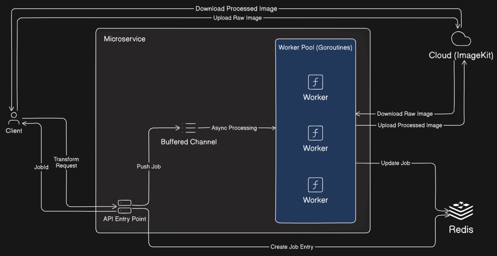

# ImageT – Scalable Image Processing Microservice (Golang)

## Introduction

ImageT is a lightweight and modular Go microservice for high-performance image processing. It is designed with scalability in mind and leverages Go’s native concurrency model using goroutines and channels to efficiently process image transformation jobs.

## Core Idea

- Concurrent job execution using a worker pool
- Redis for job metadata and status tracking
- ImageKit for storing and delivering raw and processed images

This architecture allows ImageT to handle multiple image jobs efficiently while remaining simple and extensible.

## Tech Stack

- **Language:** Go (Golang)
- **Web Framework:** Gin
- **Concurrency:** Goroutines & Channels
- **Data Store:** Redis
- **Image Storage:** ImageKit

## Architecture



## Project Structure

- `cmd/api/` – Application entrypoint
- `internal/handler/` – HTTP route handlers
- `internal/infra/` – External integrations (Redis, ImageKit)
- `internal/model/` – Data models
- `internal/service/` – Business logic (image processing)
- `internal/utils/` – Utility functions
- `internal/worker/` – Worker pool and job execution

## Local Setup

### Prerequisites

- Go 1.25+
- Redis server (local or Docker)
- ImageKit account (API credentials)

### Steps

1. **Clone the repository:**
   ```sh
   git clone https://github.com/ramdhankumar1425/imaget
   cd imaget
   ```
2. **Install dependencies:**
   ```sh
   go mod tidy
   ```
3. **Configure environment variables:**
   - Set environment variables as specified in .env.example file.
4. **Run Redis:**

   ```sh
   docker run -p 6379:6379 redis
   ```

5. **Start the API server:**
   ```sh
   go run cmd/api/main.go
   ```
6. **Test the API:**
   - Use Postman, curl, or any HTTP client,
